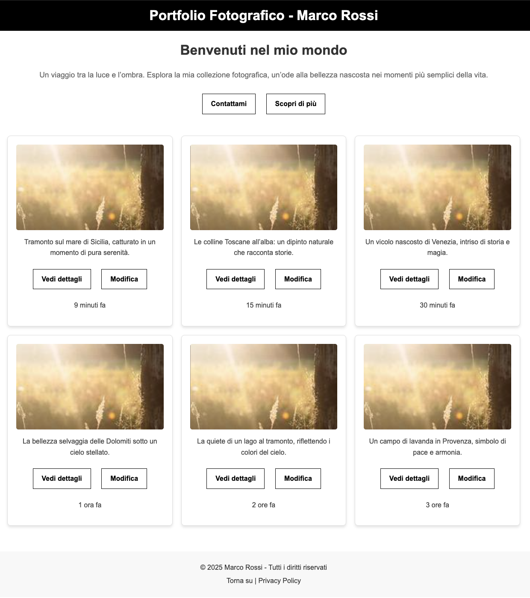

---
tags:
  - btech
  - session-44
  - exercise
---

# Jour 7 : Web Design

## Exercice 2 :

Toujours sur la même page d'accueil :

À vous de créer maintenant le mockup !

Toujours selon votre degré de confiance, vous pouvez le réaliser sous un format :

- papier/crayon
- logiciel de wireframe
- directement en HTML et CSS

### Conseils

Rappelez-vous les règles d'un mockup :

- représentation proche du final
- couleurs, typographies, padding, etc...
