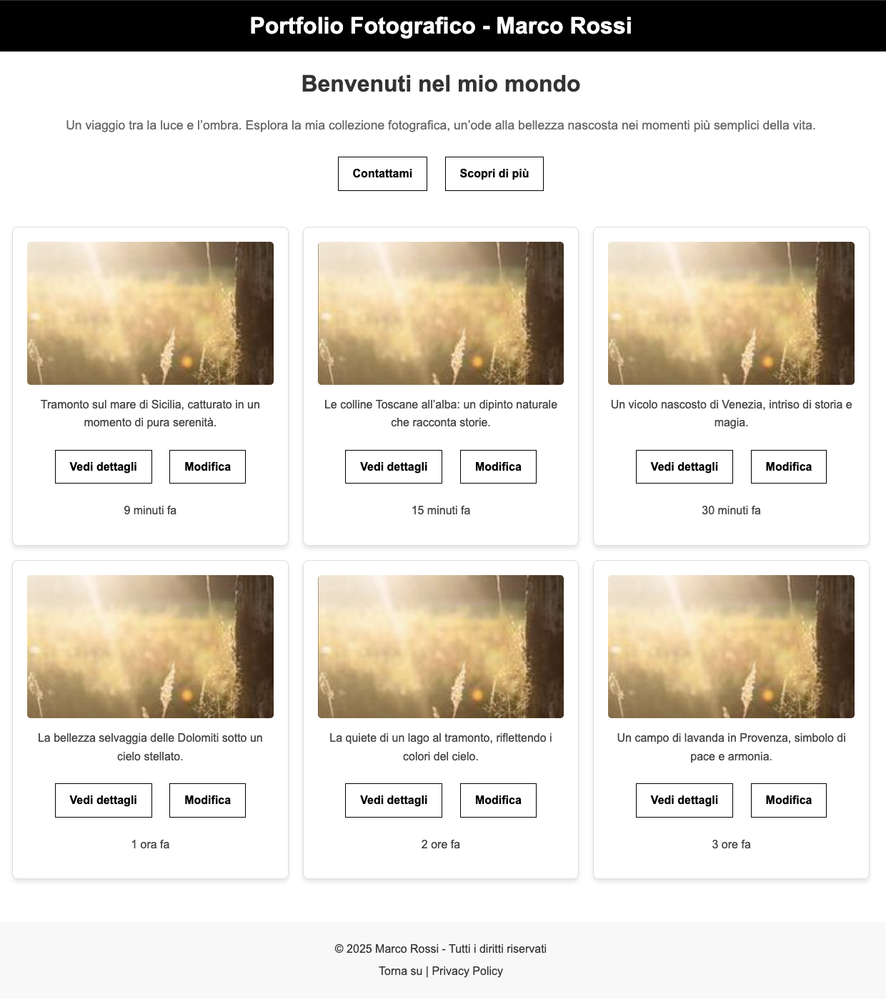

---
tags:
  - btech
  - session-44
  - exercise
---

# Jour 7 : Web Design

## Exercice 4 :

Vous vous souvenez de cette page d'accueil ?

À vous de la reproduire une nouvelle fois mais avec un framework !

Vous pouvez utiliser Materialize, sinon un autre framework (à vos risques et périls).

### Conseils

- il va être difficile (voire impossible) de reproduire à la perfection ; contentez-vous d'en approcher coté structure avant tout.
- le texte doit toujours être le même
- les images n'ont pas à être les mêmes
